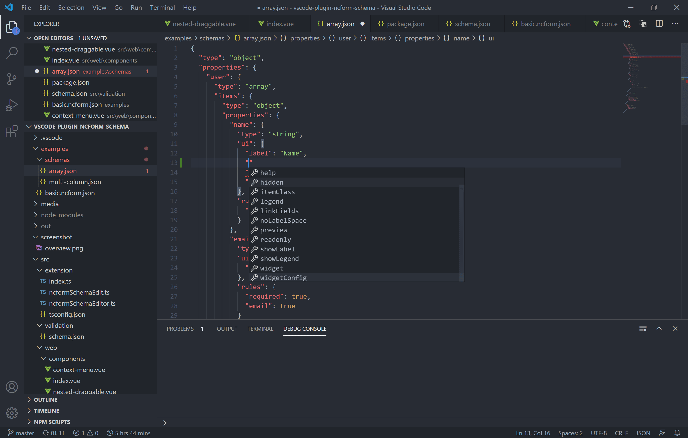

# vscode-plugin-ncform-schema

> ncform schema editor plugin for vscode

[](https://marketplace.visualstudio.com/items?itemName=F-loat.vscode-plugin-ncform-schema)
[](https://marketplace.visualstudio.com/items?itemName=F-loat.vscode-plugin-ncform-schema)
[](https://marketplace.visualstudio.com/items?itemName=F-loat.vscode-plugin-ncform-schema)

## 安装

插件商店搜索 `ncform` 后安装即可

## 功能

* 可视化编辑


* 代码智能提示



## 使用

* 点击 `JSON` 文件右上角工具栏图标切换编辑模式

* 智能提示默认对 `schemas?` 文件夹内的 `JSON` 文件生效

* 自定义智能提示[关联规则](https://code.visualstudio.com/Docs/languages/json#_json-schemas-and-settings)

``` json
{
  "$schema": "https://raw.githubusercontent.com/F-loat/vscode-plugin-ncform-schema/master/src/validation/schema.json"
}
```

## 开发

* 克隆项目

``` sh
git clone https://github.com/F-loat/vscode-plugin-ncform-schema.git
```

* 安装依赖

``` sh
npm install
```

* 调试插件

使用 VSCode 打开项目，执行 `yarn build`，然后按下 F5 开始调试

* 调试页面

开启页面调试配置，并执行 `yarn serve`

``` ts
// src\extension\ncformSchemaEditor.ts
export class NcFormSchemaEditorProvider implements vscode.CustomTextEditorProvider {
  // ...
  private static readonly isDev = true;
  // ...
}
```
